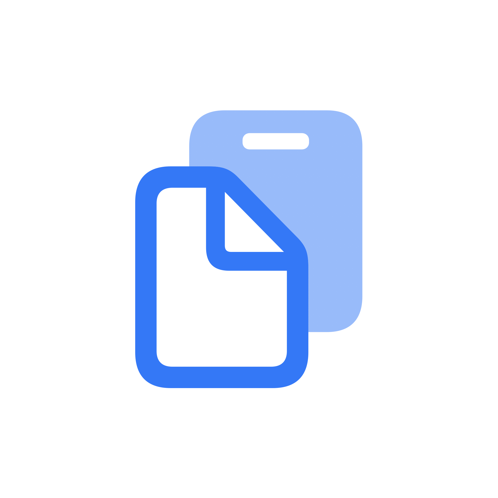

<p align="center">
  
</p>

<h1 align="center">ClipX — Copy less, paste more</h1>

<p align="center">
  一款轻量的 macOS 菜单栏剪切板管理工具。再也不会丢失复制过的内容。
</p>

<p align="center">
  <a href="#功能">功能</a> &bull;
  <a href="#下载">下载</a> &bull;
  <a href="#构建">构建</a> &bull;
  <a href="#许可">许可</a>
</p>

---

## 功能

- **菜单栏驻留** — 常驻 macOS 菜单栏，不占 Dock 空间
- **剪切板历史** — 自动记录文本、图片、文件复制的历史
- **智能分类** — 自动识别文本、图片、视频、文件类型
- **搜索筛选** — 支持类型筛选 + 关键词搜索
- **全局热键** — `Cmd+Shift+V`（可自定义）随时随地唤出面板
- **光标定位** — 面板在鼠标光标位置弹出
- **200 条记录** — 本地持久化，重启后仍在
- **多语言** — 中文 / English，跟随系统语言，也可手动切换

## 下载

从 [Releases](https://github.com/BABYSHARPYIN/ClipX/releases) 下载最新 DMG。

打开 DMG，将 **ClipX.app** 拖入 **应用程序** 文件夹即可。

> 首次运行时，请在 **系统设置 > 隐私与安全性 > 辅助功能** 中授权 ClipX，否则全局热键无法使用。

## 构建

```bash
git clone https://github.com/BABYSHARPYIN/ClipX.git
cd ClipX
bash scripts/build_app.sh
open build/ClipX.app
```

或在 Xcode 中打开 `ClipboardHistory.xcodeproj`，按 `⌘R` 运行。

**环境要求**：macOS 14+、Xcode 15+、Swift 5.9

## 使用

| 操作 | 快捷键 |
|------|--------|
| 显示 / 隐藏面板 | `Cmd+Shift+V`（可自定义） |
| 点击菜单栏图标 | 显示面板 |
| 右键菜单栏图标 | 设置、关于等 |
| 点击历史记录 | 复制回剪切板 |
| 输入关键词 | 搜索过滤 |
| 点击分类标签 | 按类型筛选 |

## 反馈

发现问题或有建议？

- [GitHub Issues](https://github.com/BABYSHARPYIN/ClipX/issues)
- 邮箱：[1455395994@qq.com](mailto:1455395994@qq.com)

## 许可

MIT © [Rio](https://github.com/BABYSHARPYIN)
